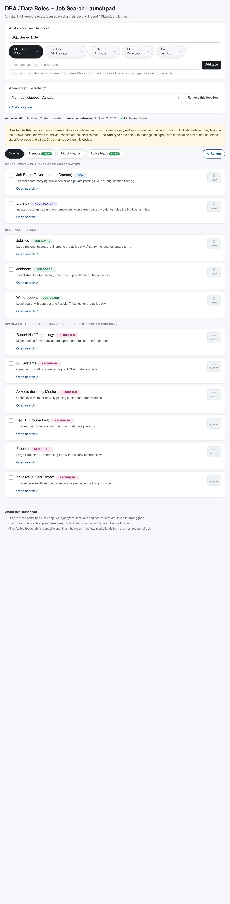
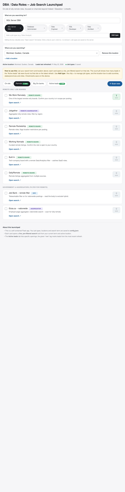
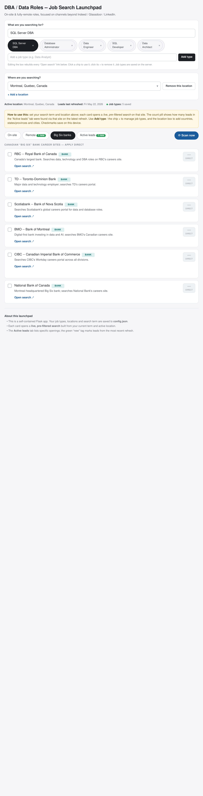
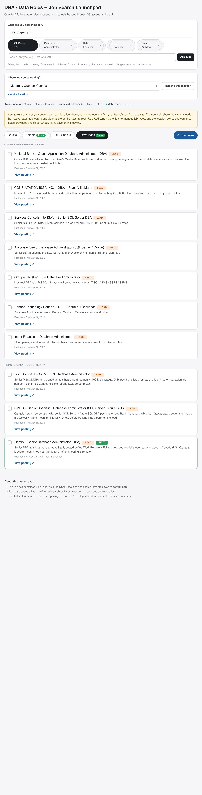

# DBA / Data Roles — Job Search Launchpad

A local web app that turns a scattered job hunt into a single, organised launchpad.
Instead of re-typing the same search into a dozen different job sites, you set your
search term and location **once** — the launchpad builds a live, pre-filtered search
link for every site, tracks specific openings worth a look, and lets you tick off
what you've already checked.

It is built for **database and data roles** (SQL Server DBA, Database Administrator,
Data Engineer, and similar) and deliberately focuses on channels **beyond** the
usual Indeed / Glassdoor / LinkedIn trio — government boards, regional boards,
employer-page aggregators, remote-only boards, specialist IT recruiters, and the
Big Six Canadian banks' own career sites.



---

## Table of contents

- [What it does](#what-it-does)
- [Screenshots](#screenshots)
- [Requirements](#requirements)
- [Installation](#installation)
- [Running the app](#running-the-app)
- [How to use it](#how-to-use-it)
  - [1. Set your search term](#1-set-your-search-term)
  - [2. Manage your job types](#2-manage-your-job-types)
  - [3. Set your location](#3-set-your-location)
  - [4. Work the four tabs](#4-work-the-four-tabs)
  - [5. Track progress with checkmarks](#5-track-progress-with-checkmarks)
  - [6. Scan for new roles](#6-scan-for-new-roles)
- [How it works](#how-it-works)
- [The `config.json` file](#the-configjson-file)
- [Job sites included](#job-sites-included)
- [Extending it](#extending-it)
- [Troubleshooting](#troubleshooting)
- [Notes and limitations](#notes-and-limitations)

---

## What it does

The launchpad has several moving parts.

**Live search links.** Every job site is shown as a card with an "Open search" link.
The link is *not* static — it is rebuilt from your current search term and active
location. Change the term from "SQL Server DBA" to "Data Engineer" and every link on
the page updates instantly to point at that search. Switch your location from
Montreal to Toronto and the city/state-aware links re-target accordingly.

**Editable job types.** The search term presets ("SQL Server DBA", "Database
Administrator", and so on) are fully editable. Add a new one, remove one you don't
need — your set is saved to disk and reloaded next time.

**Editable locations.** You can store as many locations as you like, each with a
**country**, **state / province** and **city**. The active location drives every
location-aware search link on the page. Add Toronto, add a US city, switch between
them with a dropdown.

**A "Big Six banks" tab.** A dedicated tab links straight into the career sites of
Canada's six largest banks — RBC, TD, Scotiabank, BMO, CIBC and National Bank of
Canada — each pre-filtered to your current search term. Banks are major employers of
database and data professionals and often post roles to their own portals first.

**An "Active leads" tab.** Beyond generic search links, the launchpad keeps a list of
**specific openings** worth verifying — company, role, a one-line summary, the date
it was first seen, and a direct link to the posting. Leads found on the most recent
refresh are flagged as "New" with a green highlight.

**A live scan.** The **⟳ Scan now** button checks the Workday banks (TD, BMO, CIBC)
for roles posted in the **last ~24 hours**, searching across *every* job type you
have saved. It shows a progress bar while it works and puts a real count on each
bank card. (Other sites have no reliable open API and aren't auto-scanned.)

**Per-device progress tracking.** Every card has a checkbox. Tick the sites you've
already searched or the leads you've already reviewed; the state is remembered in
your browser so the page picks up where you left off.

---

## Screenshots

### On-site tab

Job sites for on-site / local roles, grouped into government & aggregators, regional
job boards, and specialist IT recruiters. The search-term box, job-type presets and
location selector sit at the top.


### Remote tab

Remote-only job boards plus government / aggregator searches with a remote filter
applied. The "Remote" tab chip carries a green count when the latest refresh found
new remote leads.



### Big Six banks tab

Direct links into the career sites of Canada's six largest banks — RBC, TD,
Scotiabank, BMO, CIBC and National Bank — each pre-filtered to your search term.
The **⟳ Scan now** button is visible at the right of the tab bar.



### Active leads tab

Specific openings to verify, split into on-site and remote. Each lead shows a summary,
the date it was first seen, and a direct link. New leads from the latest refresh get a
green "New" badge and a highlighted border.



---

## Requirements

- **Python 3.8 or newer** (developed and tested on Python 3.10+)
- **Flask** and **requests** — installed via the step below
- A web browser

No database, no build step, nothing else to install. The app reaches the internet
when you click through to a job site and when you run a scan.

---

## Installation

From inside the `dba-launchpad` folder:

```bash
pip install -r requirements.txt
```

That installs Flask, the only dependency. If you prefer to keep things isolated, use
a virtual environment first:

```bash
python -m venv .venv
source .venv/bin/activate        # on Windows: .venv\Scripts\activate
pip install -r requirements.txt
```

---

## Running the app

```bash
python app.py
```

You will see:

```
  DBA / Data Roles -- Job Search Launchpad
  Open this in your browser:  http://127.0.0.1:5050
```

Open **http://127.0.0.1:5050** in your browser. To stop the app, press `Ctrl+C` in
the terminal.

You can re-run `python app.py` at any time **without** stopping the old instance
first — on startup the app automatically reclaims its port, stopping any earlier
instance still listening on it. No more "Address already in use" errors.

To run it on a different port:

```bash
PORT=8080 python app.py
```

---

## How to use it

### 1. Set your search term

The box at the top — *"What are you searching for?"* — holds the term that every
search link is built from. Type into it and watch the "Open search" links update as
you type. Whatever you leave in the box is saved, so it is still there next time you
open the app.

### 2. Manage your job types

Under the search box is a row of **preset chips** — quick one-click search terms.

- **Use a preset:** click the chip text; it drops straight into the search box.
- **Remove a preset:** click the small `×` on the chip.
- **Add a preset:** type into the *"Add a job type"* field and click **Add type**
  (or press Enter).

Your job-type list is saved on the server (in `config.json`), so it survives
restarts and is shared across browsers.

### 3. Set your location

The second box — *"Where are you searching?"* — controls the location that
location-aware search links target.

- **Switch location:** pick a different entry from the dropdown. The page reloads and
  every city/state-aware link re-targets to that location.
- **Add a location:** click **Add a location**, fill in any of **Country**,
  **State / Province** and **City** (at least one is required), and click **Add**.
  The new location becomes active immediately.
- **Remove a location:** select it in the dropdown and click **Remove this
  location**. You must always keep at least one.

### 4. Work the four tabs

**On-site** — job sites useful for local / on-site roles, grouped into:

- *Government & employer-page aggregators* — Job Bank, Eluta
- *Regional job boards* — Jobillico, Jobboom, Workhoppers
- *Specialist IT recruiters* — Robert Half, S.i. Systems, Akkodis, Fed IT, Procom,
  Kovasys (many senior and contract roles go through recruiters before they are ever
  posted publicly)

**Remote** — job sites for fully-remote roles:

- *Remote-only job boards* — We Work Remotely, Jobgether, Remote Rocketship, Working
  Nomads, Built In, DailyRemote
- *Government & aggregators* — Job Bank and Eluta with a remote filter applied

**Big Six banks** — direct links into the career sites of Canada's six largest banks:
RBC, TD, Scotiabank, BMO, CIBC and National Bank of Canada. Each card opens that
bank's careers portal pre-filtered to your search term. Banks are major employers of
database and data talent and often post to their own portals first. These cards show
`—` ("direct"), like the recruiter cards — they are not lead-counted.

**Active leads** — specific openings to verify, split into on-site and remote. Each
lead card shows the company and role, a one-line description, the date it was first
seen, and a **View posting** link. Always confirm a role is still open, the right
seniority, and (for remote roles) actually open to candidates in your country before
applying.

**About the count pills.** Each job-site card carries a small pill. It shows how many
leads in the "Active leads" tab were found via that site on the most recent refresh.
A pill sits quietly at `0` on quiet days and turns **green** when something new lands.
Recruiter and bank cards show `—` ("direct") because they are not lead-counted. The
tab chips themselves show a green *"N new"* badge when the latest refresh added new
leads.

### 5. Track progress with checkmarks

Every card — site cards and lead cards alike — has a checkbox. Tick the ones you have
already worked through; ticked cards dim so your eye skips them. This state is stored
in your browser **on that device**, so it is private to you and does not sync.
The **Clear all checkmarks** button at the bottom resets them.

### 6. Scan for new roles

At the right-hand end of the tab bar is the **⟳ Scan now** button. It checks the
three banks whose careers run on Workday — **TD, BMO and CIBC** — for roles
**posted in the last ~24 hours** (today or yesterday).

When you click it, a progress bar appears. As each bank finishes, a result chip
appears on its card:

- **green** — *N* roles posted in the last ~24h, plus the total matching count
- **grey** — scanned fine, but nothing posted that recently
- **amber** — the bank blocked the automated request
- **red** — the scan could not be completed

When the scan finishes, the bar shows how many new roles turned up across the banks.

**It searches all your job types — this is the important part.** Job-site search
engines need *every* word you type to appear in a posting, so a specific phrase like
"SQL Server DBA" matches nothing even at a bank full of database roles — the bank
titles them "Database Administrator". To get around that, the scan searches each
bank for **every job type in your presets** ("SQL Server DBA", "Database
Administrator", "Data Engineer", …) and merges the results, de-duplicated by job.
So as long as *one* of your job types is worded the way postings actually are, the
count comes out right. Add or remove job types (step 2) to tune what the scan looks
for; hover a result chip to see the per-job-type breakdown.

**Why only the banks.** TD, BMO and CIBC run on Workday, which exposes a JSON jobs
API that returns each posting's title and posted date — fast, reliable, no setup.
The other career sites (RBC, Scotiabank, National Bank, and the general job boards)
are JavaScript apps with no comparable open API and no dependable way to read a
filtered, date-aware count, so they are deliberately *not* auto-scanned — their
cards stay as one-click search links. This is a conscious choice: show real numbers
only where they can be trusted.

A scan makes real requests to a real careers API, so it takes a little time — a run
across the three banks usually finishes within a minute.

---

## How it works

The app is a single Python file, `app.py`, containing both the Flask backend and the
launchpad page (HTML, CSS and JavaScript embedded as a template string).

- **The page** renders the cards in the browser from data the server injects: the
  site catalogue, your job types, your locations and the leads list.
- **Search links** use placeholder templates such as
  `https://www.eluta.ca/search?q={Q}&l={CITY_ENC}+{STATE_ENC}`. The browser
  substitutes `{Q}` (your encoded term), `{S}` (a term slug) and the location
  placeholders (`{CITY}`, `{CITY_ENC}`, `{CITY_SLUG}`, `{STATE}`, `{STATE_ENC}`,
  `{STATE_SLUG}`, `{COUNTRY}`, `{COUNTRY_ENC}`) so the link always reflects the
  current term and active location.
- **Editing actions** (add/remove a job type, add/remove/switch a location, change
  the term) post to small JSON API endpoints, which update `config.json` and reload
  the page.
- **State** lives in two places: everything editable is persisted server-side to
  `config.json`; checkmarks are kept browser-side in `localStorage`.
- **Scanning** calls `/api/scan` once per Workday bank. The server searches that
  bank's JSON job API (`/wday/cxs/.../jobs`) for every saved job type, merges and
  de-duplicates the postings by job path, and counts those whose `postedOn` is today
  or yesterday. Non-Workday sites return a "skip" response and are not scanned.

### API endpoints

| Method & path | Purpose |
|---|---|
| `GET /` | The launchpad page |
| `POST /api/job-types/add` | Add a job type — body `{"name": "..."}` |
| `POST /api/job-types/delete` | Remove a job type — body `{"name": "..."}` |
| `POST /api/locations/add` | Add a location — body `{"country","state","city"}` |
| `POST /api/locations/delete` | Remove a location — body `{"id": "..."}` |
| `POST /api/locations/active` | Switch active location — body `{"id": "..."}` |
| `POST /api/term` | Save the current search term — body `{"term": "..."}` |
| `POST /api/scan` | Scan one bank for recent postings — body `{"site_id"}` |

---

## The `config.json` file

All editable state is stored in `config.json` next to `app.py`. It is created
automatically from sensible defaults on first run. The structure:

```jsonc
{
  "term": "SQL Server DBA",          // current search term
  "job_types": [ "SQL Server DBA", ... ],   // preset chips
  "locations": [
    { "id": "loc-montreal", "country": "Canada",
      "state": "Quebec", "city": "Montreal" }
  ],
  "active_location": "loc-montreal", // id of the active location
  "last_scan": "Fri May 22, 2026",   // a lead counts as "new" when its
                                     //   firstSeen matches this date
  "leads": {
    "leads-onsite": [ { "name", "src", "firstSeen", "desc", "url" }, ... ],
    "leads-remote": [ ... ]
  }
}
```

You can edit `config.json` by hand while the app is stopped, or just use the in-app
controls while it is running. If the file is ever deleted or becomes corrupt, the app
quietly recreates it from defaults.

---

## Job sites included

The site catalogue currently leans Canada-first, reflecting the original use case
(Montreal on-site and remote-in-Canada roles):

- **Aggregators / government:** Job Bank (Government of Canada), Eluta.ca
- **Regional boards:** Jobillico, Jobboom, Workhoppers
- **IT recruiters:** Robert Half Technology, S.i. Systems, Akkodis, Fed IT, Procom,
  Kovasys
- **Remote-only boards:** We Work Remotely, Jobgether, Remote Rocketship, Working
  Nomads, Built In, DailyRemote
- **Big Six bank career sites:** RBC, TD, Scotiabank, BMO, CIBC, National Bank of
  Canada — direct employer portals, searched by keyword

If you set a location outside Canada the links still work as searches, but the
Canada-specific boards (Job Bank, Jobillico) will be less useful. See *Extending it*
below.

---

## Extending it

The site catalogue is the `SITES` dictionary near the top of `app.py`. To add a job
site, append an entry to the relevant group with a `name`, `badge` (a CSS class such
as `b-board`), `label`, `desc` and a `tpl` URL template using the placeholders listed
above. Recruiter-style cards that should not be lead-counted take `"noCount": True`.

Common extensions you might want:

- Add job boards for other countries so non-Canada locations are well served.
- Wire automatic weekday scanning into the app so the "Active leads" tab refreshes
  itself instead of being seeded manually.
- Add more search-term placeholders, or a language toggle for bilingual boards.

---

## Troubleshooting

**Port already in use.** The app reclaims its port automatically on startup — it
stops any process still listening there before binding, so simply re-running
`python app.py` works. If you specifically want a different port, run
`PORT=8080 python app.py`.

**"Could not reach the server" alert when adding a job type or location.** The Flask
app has stopped — restart it with `python app.py` and reload the page.

**A search link opens an empty or odd result page.** Job sites change their URL
formats over time. Update the relevant `tpl` in the `SITES` dictionary in `app.py`.

**My checkmarks disappeared.** Checkmarks are stored per-browser, per-device. They do
not move between browsers or machines, and clearing your browser data clears them.

**Edited `config.json` and the app ignores it.** Edits to `config.json` are read on
each request, but make changes while the app is *not* mid-write — easiest is to stop
the app, edit, then start it again.

---

## Notes and limitations

- The launchpad's **search links** don't fetch anything — they just open a pre-built
  search on the job site. The **Scan** feature *does* make live requests to the
  Workday bank APIs to count roles posted recently; always open a posting to confirm
  the details before applying.
- The scanner could not be tested against the live Workday API in the build
  environment (its network blocks that domain). The API calls follow Workday's
  documented request shape, but verify the counts look right on your own machine.
- The "Active leads" list and the `last_scan` date are seed data. They do not update
  on their own — refreshing them is a separate task.
- The development server (`python app.py`) is meant for **local, single-user** use.
  Do not expose it to the public internet.
- Checkmark state is browser-local and is not backed up.
